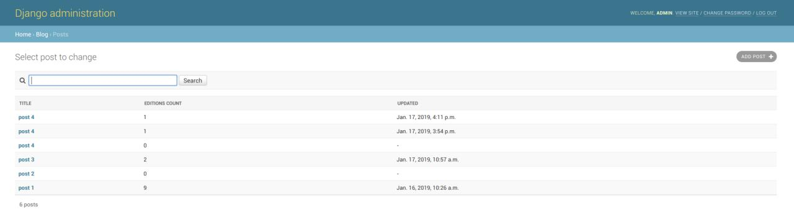
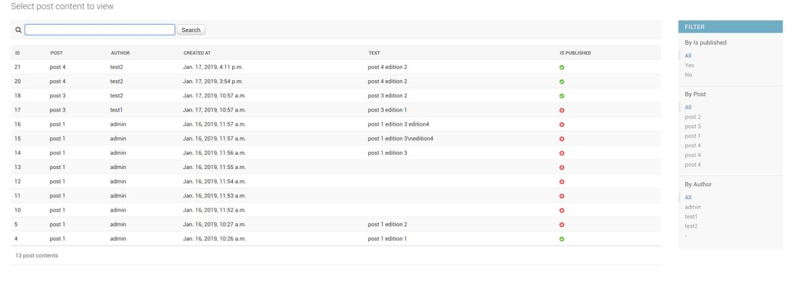
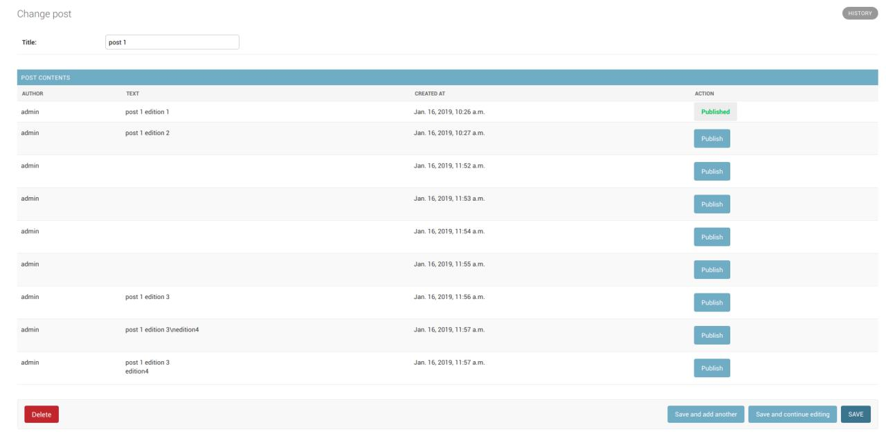

# WikiApi
**API for blog (such as Wikipedia) creation and edition**

### Installation:
The project was placed in a docker container.
To run the project must be installed [docker](https://docs.docker.com/install/linux/docker-ce/ubuntu/) and [docker-compose](https://www.digitalocean.com/community/tutorials/how-to-install-docker-compose-on-ubuntu-16-04)


**To start the server:**
```bash
sudo docker-compose up --build
```

**To run tests:**
```bash
sudo docker-compose run web python manage.py test
```


**To create superuser:**
```bash
sudo docker-compose run web python manage.py createsuperuser
```

### API endpoints:
To send request as user need to pass to Headers:
`{Authorization: Token <token>}`

**Sign in**
Get user token by username and password
* Type: `POST`
* URL: `/api/v1/auth/`
* Args: `username; password`
* Permissions: `AllowAny`

**Post list**
List of available posts
* Type: `GET`
* URL: `/api/v1/post/`
* Args: `-`
* Permissions: `Allow any`

**Post detail**
Get detail information about specific post
* Type: `GET`
* URL: `/api/v1/post/<id>`
* Args: `'id' - post id`
* Permissions: `Authorized users only`

**Post create**
Create new post
* Type: `POST`
* URL: `/api/v1/post/`
* Args: `'title' - charfield, text - textfield`
* Permissions: `Allow any`

**Post edit**
Edit post by id
* Type: `POST`
* URL: `/api/v1/post/<id>/edit/`
* Args: `'text' - textfield`
* Permissions: `Authorized users only`

**Post content list**
List of available post editions
* Type: `GET`
* URL: `/api/v1/post/<post_id>/editions/`
* Args: `post_id - id of the post`
* Permissions: `Allow any`

**Post content detail**
Detail information about specific post edition.

**If needed to get current edition, just pass "current" as id**
* Type: `GET`
* URL: `/api/v1/post/<post_id>/editions/<id>`
* Args: `post_id - id of the post; id - id of the post edition`
* Permissions: `Allow any`

**Post content set publish**
Mark post edition as published
* Type: `GET`
* URL: `/api/v1/post/<post_id>/editions/<id>/set_published/`
* Args: `post_id - id of the post; id - id of the post edition`
* Permissions: `Admin users only`


### Additional features:
#### Admin pages:

**Post list (with search)**


**Post content list (with search and filters)**


**Post edit (able to change title and publish edition)**


### Task:
   **Разработать сервер сайд с REST JSON API для создания и  управления контентом WiKi страниц.**

**Features requirements:**
* WiKi страница состоит из двух полей: title, text. Также могут быть любые другие вспомогательные поля на усмотрение разработчика
* При редактировании WiKi страницы создаются новые версии, т.е. единожды созданная версия в будущем остается неизменной
* После редактирования страницы новая версия становится “текущей”
* Администратор может решить что последняя версия не прошла модерацию и сделать “текущей” любую другую версию


**REST JSON API должен поддерживать следующие методы:**
* получение списка имеющихся страниц
* получение списка версий одной страницы
* получение любой версии одной страницы
* получение “текущей” версии одной страницы (может быть инвариантом предыдущего метода)
* редактирование страницы (создать новую версию с новыми значениями полей)
* метод позволяющий сделать любую из версий текущей

**Architecture requirements:**
* SQLAlchemy + Flask | Django
* PostgreSQL
* PEP-8 compliant code

**Deliverables:**
* Код в виде проекта на github
* Подробная инструкция по инсталляции и запуску проекта в  README.md
* Unit tests
* Integration tests for components
* End to end tests for REST JSON API
